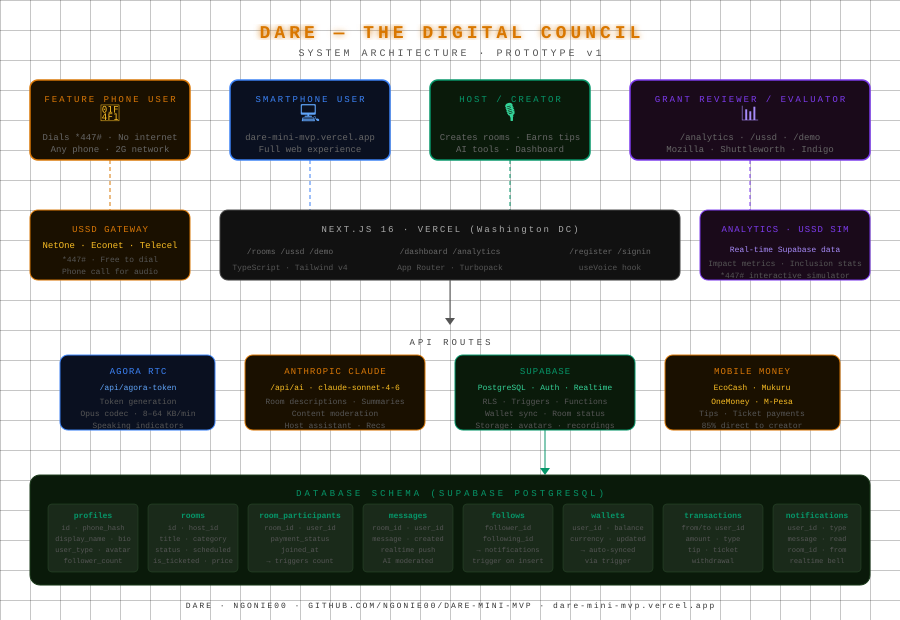

# Dare — The Digital Council

[](https://dare-mini-mvp.vercel.app)
[](LICENSE)
[](#technology-stack)
[](#)

---

## What is Dare?

**Dare** (*/daː.ɾe/* · Shona) — *a traditional community council where every voice has a seat.*

Dare is a digital voice infrastructure designed for inclusion at scale. It enables communities to host, join, and sustain live voice conversations — regardless of device, bandwidth, or financial access.

Where most platforms assume smartphones and stable internet, Dare is designed for constraint:

- Works on feature phones via USSD
- Operates on ultra-low bandwidth (2G compatible)
- Integrates mobile money systems common in the Global South

**Built in Zimbabwe. Designed for global applicability.**

---

## The Problem

Digital participation is not evenly distributed.

| Constraint | Outcome |
|---|---|
| Limited smartphone access | Entire populations excluded from modern platforms |
| High data costs | Voice and streaming become inaccessible |
| Financial infrastructure barriers | Creators cannot monetise their work |
| Algorithmic platforms | Communities lose control over visibility and reach |

*The result: the majority are connected — but not meaningfully included.*

---

## The Solution

Dare introduces a dual-access system:

```
Feature Phone Access (*447#)          Smartphone Access (Web App)
→ USSD navigation                     → Full real-time voice experience
→ Audio via standard phone call       → Structured participation tools
→ Payments via mobile money           → AI-assisted moderation & summarisation
→ No app. No data. No exclusion.      → Analytics and monetisation dashboard
```

This is not just accessibility. It is participation infrastructure.

---

## Architecture



Dare is built as a layered system:

- **Client Layer** — Next.js interface (web + mobile-ready)
- **Realtime Layer** — Supabase + Agora for live interaction
- **Intelligence Layer** — AI-powered moderation and summarisation
- **Access Layer** — USSD gateway + telephony integration

This enables parallel access paths: internet-based (smartphone) and telecom-based (feature phone).

---

## Live Demo

**→ [dare-mini-mvp.vercel.app](https://dare-mini-mvp.vercel.app)**

| Area | Description |
|---|---|
| `/rooms` | Discover and join live sessions |
| `/ussd` | Simulated feature phone experience |
| `/analytics` | Real-time participation metrics |
| `/demo` | Preloaded user personas |
| `/register` | Phone-based onboarding |

### Representative Users

The platform is designed for diverse, real-world roles:

- Community health practitioners
- Small-scale farmers
- Educators and students
- Local journalists
- Youth organisers
- Informal sector entrepreneurs

*Dare reflects how people actually communicate, not how platforms assume they do.*

---

## Core Capabilities

### Access
- Join from any device — smartphone or feature phone
- Adaptive audio for low-bandwidth environments
- No email required — phone-based identity

### Participation
- Structured voice interaction (raise hand, moderated speaking)
- Real-time communication with low latency
- Multilingual by design
- Session recording with post-session playback for all participants

### Economic Inclusion
- Mobile money tipping and ticketing (EcoCash, Mukuru, OneMoney, M-Pesa)
- No dependency on traditional banking systems
- Transparent earnings tracking — 85% direct to creators

### Intelligence Layer
- AI-assisted content moderation
- Session summaries for knowledge retention
- Host support tools for structured dialogue
- Personalised room recommendations

---

## Technology Stack

| Layer | Technology |
|---|---|
| Frontend | Next.js 16 + TypeScript + Tailwind v4 |
| Backend | Supabase (PostgreSQL, Realtime, Auth, Storage) |
| Voice | Agora RTC (Opus codec, adaptive bitrate) |
| AI | Claude — Anthropic (`claude-sonnet-4-6`) |
| Deployment | Vercel |

---

## Database Schema

```
profiles          — identity, bio, avatar, user_type
rooms             — session metadata, status, ticket config, recording_url
room_participants — active participants + payment_status
messages          — real-time chat per room (AI-moderated before posting)
follows           — follower relationships + notification triggers
wallets           — balance synced via Postgres trigger on transactions
transactions      — tips, ticket payments, withdrawals
notifications     — real-time bell notifications
```

---

## AI as Infrastructure

AI in Dare is not ornamental — it is functional:

- Enhances clarity in discussions
- Supports hosts in real time
- Preserves knowledge through summaries
- Maintains safety through moderation

The goal is not automation. It is better collective thinking.

---

## Design Principles

- **Inclusion-first** — works under real-world constraints
- **No algorithmic distortion** — chronological, transparent visibility
- **Creator sovereignty** — ownership of audience and data
- **Economic fairness** — majority revenue to creators
- **Interoperability** — designed to integrate, not isolate

---

## Roadmap

- [ ] Native phone authentication (SMS OTP via Twilio)
- [ ] Live USSD network integration (NetOne · Econet · Telecel)
- [ ] Offline-resilient session playback
- [ ] Expanded language support (Shona, Ndebele, Swahili, Hausa, Amharic)
- [ ] Feature phone hosting capabilities
- [ ] Payment dispute and escrow systems

---

## Positioning

Dare is not simply a social platform. It is:

- a communication layer
- a participation system
- a foundation for digital public discourse

---

## Grant Applications

Currently seeking evaluation from:

- **Mozilla Builders** — open source, digital inclusion
- **Shuttleworth Foundation** — social innovation, open access
- **Indigo Trust** — digital rights, Global South infrastructure
- **POTRAZ–NUST 2026 ICT Research Symposium** — Bulawayo, 1–4 September 2026

---

## Getting Started

```bash
git clone https://github.com/NGONIE00/dare-mini-mvp
cd dare-mini-mvp
npm install
cp .env.example .env.local   # add your keys
npm run dev
```

### Environment variables

```
NEXT_PUBLIC_SUPABASE_URL=
NEXT_PUBLIC_SUPABASE_ANON_KEY=
NEXT_PUBLIC_AGORA_APP_ID=
AGORA_APP_CERTIFICATE=
ANTHROPIC_API_KEY=
```

### Database setup

Run in Supabase SQL Editor in order:
1. `fix-rls.sql` — RLS policies and storage buckets
2. `seed-fixed.sql` — demo users and rooms
3. `fix-wallet.sql` — wallet trigger
4. `room-management.sql` — room delete cascade

---

## Author

**Ngonidzashe** · [@NGONIE00](https://github.com/NGONIE00)

Building systems for inclusive digital participation.

---

*Dare means council.*
*A place where voices are heard,*
*not amplified by algorithms —*
*but recognised through substance.*
